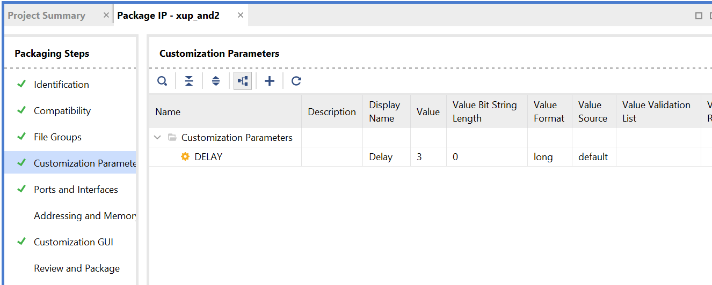
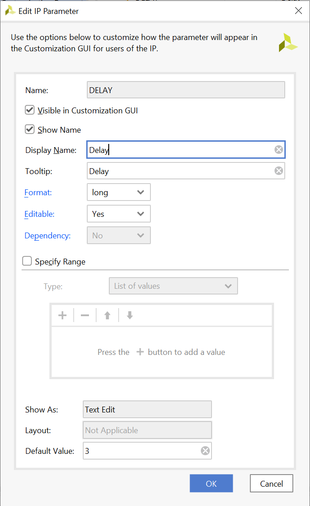
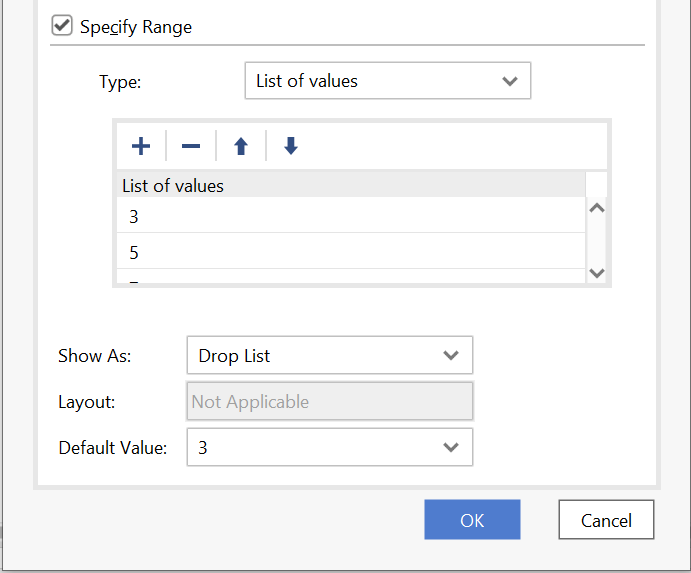
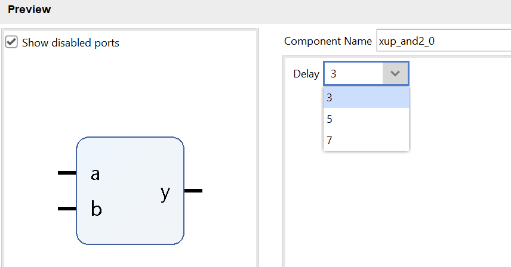
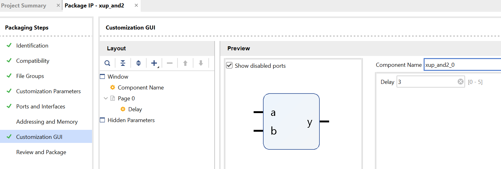
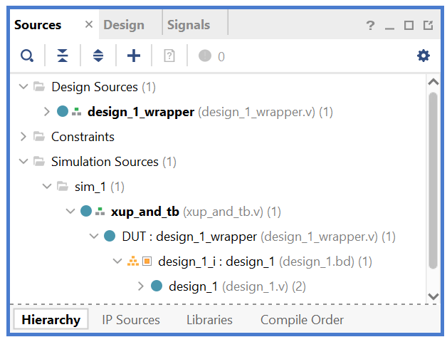
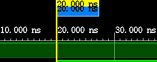

# Buidling Basic Elements for IPI

## Introduction

This lab guides you through creating basic elements which can be used in basic digital design course. The steps can be used to extend it to creating IP of any complexity.

## Objectives

After completing this lab, you will be able to:

- Use Create and Package IP feature of Vivado to create IP

- Simulate and verify IP functionality 

- Generate the bitstream and verify the functionality in hardware

## Procedure

This lab is separated into steps that consist of general overview statements that provide information on the detailed instructions that follow. Follow these detailed instructions to progress through the lab.

This lab comprises 4 primary steps: You will create two custom IPs in Vivado, create another project to use the created IPs, simulate the design, and verify the functionality in the hardware. 

## Hint

###  In the instructions for the labs

The absolute path for the source code should only contain ascii characters. Deep path should also be avoided since the maximum supporting length of path for Windows is 260 characters.

**{SOURCES}** refers to *\\digital_design_tutorial\\source\\create_your_own_IPI_block*. You can download the source files for the labs from the cloned sources directory

**{LABS}** refers to *C:\digital_design_tutorial\\*. It assumes that you will create the mentioned directory structure to carry out the labs of this workshop

## Step 1 Create a Project for Creating IP in Vivado

### Create a Vivado project calling it as xup_and2 in the {SOURCES} directory using the provided xup_and2.v source file targeting the default Spartan-7 or Zynq-7000 family device*.*  Synthesize the design.

1. Open Vivado by selecting **Start > All Programs >** **Xilinx Design Tools > Vivado 2021.2 > Vivado 2021.2**

2. Click the *Create New Project* link.

3. Click **Next**, and name the project **xup_and2** in the **{LABS}** directory.

4. Click **Next** and make sure that *RTL Project* is selected.

5. Click **Next** and make sure that **Verilog** is selected as the *Target language* and *Simulation language*. Click *Add Files*, browse to ***{SOURCES}*** and select **xup_and2.v**, and click **OK**.

6. Click **Next** two times until *Add Constraints* form is displayed*.*

7. Remove any constraint files listed, if any, and click **Next** to see the *Default Part* form.

8. Click **Next** with the Spartan-7 or Zynq-7000 part selected and then **Finish**.

9. Click *Run Synthesis* in the *Flow Navigator* pane. (This step is optional but recommended to make sure that the design is synthesizable).

10. Click **Cancel** when the process is completed and the dialog box is presented. Make sure no errors are reported.

11. In the *Design Runs* tab, right click on the *synth_1* and select **Reset Runs**. 

12. Make sure that the *Delete the generated files in the working directory* option is selected and click on **Reset**.

    This makes sure that you are not providing the synthesis results.

### Set the library name and category if desired. Here you will use XUP as the library name and XUP_LIB as the category. You can change Vendor name if necessary.

1. Click *Settings* in the *Flow Navigator* pane.
2. Select *IP* in the left pane.
3. Click on the *Packager* tab.
4. Change the necessary fields as shown below and click **OK**.

Setting up the Library and Category fields

### Package the IP

1. Select **Tools > Create and Package New IP**

2. Click **Next**.

3. With the *Package your project* option selected, select **Packaging Options > Package your current project**, click **Next** twice

   The summary form will be displayed showing various components and files used in creating the IP as it stands at the moment. We will customize some of the components. Click **OK**.

   The **Package IP – xup_and2** tab will be opened showing the default values and the available options.

The IP Identification default values

4. Make necessary changes to the IP *Identification* fields as shown.

The IP Identification customized fields

5. Select **IP Compatibility**. This shows the different Xilinx FPGA Families that the IP supports. The value is inherited from the device selected for the project. 
6. Right click in the *Family Support table* and select **Add Family…** from the menu.
7. Select the **Zynq** and **Spartan7** families as we will be using this IP on the boards with these devices, and click **OK**.
8. Click on **IP File Groups** and expand the sub-folders to see its content. You can add additional files, like testbench, but we won’t do that here.

Updating IP File Groups

### Edit IP Customization Parameter with the desired default value and type of values allowed

1. Click on the *IP Customization Parameters* and verify that delay parameter is included.

2. Right-click on the *DELAY* entry under the *User Parameters*, and select **Edit Parameter…**

   The form will be displayed

   
   
   You can make the parameter fixed by selecting **No** in the *Is the value editable by the User* field. The data format can be long, float, bitstring, and string. You can change the default value (which is picked up from the model) to a different value. The value can be restricted to a list of values (with check-boxes) or even a range. Here is an example of the list of values option:
   
   
   
   which will result in following GUI when a user tries to configure in a design:
   
   

Here is an example of the range:

which will show up in the design as

3. Set the parameters editing to *range of integers* and set the range as **0** to **5**. Click **OK**.

4. Click on the *IP Ports* and verify that the top-level ports are included.

5. Click on the *IP GUI Customization Layout* and then click on the *Refresh* button to see the GUI.

   Notice that the input/output ports as well as the parameter with the default value are displayed.

   

The IP GUI Customization

6. Select *Review and Package*, and click on the **Package IP** button.
7. Click **OK**.
8. In the Vivado window click **File > Close Project.**

### Create a Vivado project calling it as xup_and_vector in the {SOURCES} directory using the provided xup_and_vector.v source file targeting the default Spartan-7 and Zynq-7000 family device*.*  

1.   Open Vivado if it was closed.
2.   Click the *Create New Project* link.
3.   Click **Next**, and name the project **xup_and_vector** in the **{SOURCES}** directory.
4.   Click **Next** and make sure that *RTL Project* is selected.
5.   Click **Next** and make sure that **Verilog** is selected as the *Target language* and *Simulation language*. Click *Add Files*, browse to **{SOURCES}** and select **xup_and_vector.v**, and click **OK**.
6.   Click **Next** two times until *Add Constraints* form is displayed*.*
7.   Remove any constraint files listed, if any, and click **Next** to see the *Default Part* form.
8.   Click **Next** with the **xc7s50csga324-1** part selected and then **Finish**.

### Set the library name and category if desired. Here you will use XUP as the library name and XUP_LIB as the category. You can change Vendor name if necessary.

1.   Click *Settings* in the *Flow Navigator* pane.

2.   Select *IP* in the left pane.

3.   Click on the *Packager* tab.

4.   Change the necessary fields and click **OK**.

### Package the IP.

1. Select **Tools > Create and IP Package**.

2. select **Package your current project**, click **Next**.

3. With the *Package your project* option selected, click **Next,** and then click **Finish**.

   The summary form will be displayed showing various components and files used in creating the IP as it stands at the moment. We will customize some of the components. Click **OK**.

   The **Package IP – xup_and_vector** tab will be opened showing the default values and the available options.

4.   Make necessary changes to the IP *Identification* fields as shown.

The IP Identification customized fields

5. Select **Compatibility**. This shows the different Xilinx FPGA Families that the IP supports. The value is inherited from the device selected for the project. 

6. Right click in the *Family Support table* and select **Add Family…** from the menu.

7. Select the **zynq** and **spartan7** families as we will be using this IP on the boards with these devices, and click **OK**.

8. Click on **IP File Groups** and expand the sub-folders to see its content. You can add additional files, like testbench, but we won’t do that here.

### Edit IP Customization Parameter with the desired default value and type of values allowed

1.   Click on the *IP Customization Parameters* and verify that DELAY and SIZE parameters are included.

2.   Right-click on the *DELAY* entry under the *User Parameters*, and select **Edit Parameters…**

The form will be displayed

3. Set the parameters editing to *range of integers* and set the range as **0** to **5**. Click **OK**.

4. Similarly, set the SIZE entry parameters to *range of integers* and set the range as **1** to **8**. Click **OK**

5. Click on the *IP Ports* and verify that the top-level ports are included.

6. Click on the *IP GUI Customization Layout* and then click on the *Refresh* button to see the GUI.

   Notice that the input/output ports as well as the parameter with the default value are displayed.

   

 7. Select *Review and Package*, and click on **Package IP.**

 8.   In the Vivado window click **File > Close Project.**

 9.   Click **OK**.

 10. Using the Windows Explorer, copy the generated xup_and2 and xup_and_vector folders into the xup_lib folder under **{LABS}** (create the folder if does not exist).

## Step 2 Create a Project for Testing the Created IPs 

### Create an empty Vivado project calling it as xup_and_test in the **{SOURCES}** directory targeting the xc7s50csga324-1 device (for Boolean) or XC7Z020clg400-1 device (for PYNQ-Z2).  Setup the IP Repository to point to {LABS}\xup_lib directory. Add the xup_and2 to the IP catalog.

1. Click the *Create New Project* link.

2. Set the directory path to **{LABS}** and the project name as **xup_and_test**.

3. Click **Next** and make sure that the *RTL Project* type is selected.

4. Click **Next** and make sure that **Verilog** is selected as the *Target language* and *Simulation language*.

5. Click **Next** three times until *Default Part* form is displayed*.*

6. Using the appropriate filters, selectxc7s50csga324-1 device (for Boolean) or XC7Z020clg400-1 device (for PYNQ-Z2), then click **Next**, and then **Finish**.

7. Click **Project Settings** in the *Flow Navigator* pane.

8. Select **IP** in the left pane of the *Project Settings* form.

9. Click on the **Add Repository…** button, browse to **{LABS}\xup_lib** and click **Select**.

   The directory will be scanned and IP entries will appear in the **Selected Repository** window.

Specify IP Repository

10. Click **OK**

### Create the block design, called system, instantiating the xup_and2 and setting the delay parameter to 5. Make the ports external.

1.   Click on the **Create Block Design** in the *Flow Navigator* pane.

2.   Set the design name to **system** and click **OK**.

3.   IP from the catalog can be added in different ways. Click on *Add IP* in the message at the top of the *Diagram* panel.

4.   Once the IP Catalog is open, type “XUP” into the Search bar, find and double click on **XUP 2-input AND** entry, or click on the entry and hit the *Enter* key to add it to the design.

5.   Double-click on the *xup_and2_0* instance to open the configuration form.

6.   Change the *Delay* value to **5** and click **OK**.

7.   Right-click on the *y* port and select **Make External**.

8.   Similarly, select the *ain* and *bin* ports and make them external.

9.   The block diagram should look like below.

The block dsign

### Instantiate the xup_and_vector. Set the Delay parameter to 2 and the Size to 3. Make the ports external.

1.   Similarly, add an instance of an **XUP n-bit wide AND** to the design.

2.   Double-click on the *xup_and_vector_0* instance to open the configuration form.

3.   Change the *Delay* value to **2** and Size to 3, and click **OK**.

4.   Right-click on the *y* port and select **Make External**.

5.   Similarly, select the *ain* and *bin* ports and make them external.

6.   The block diagram should look like below.

The block design

### Validate the design. Generate the output products and create HDL wrapper.

1. Click **Tools > Validate design** and correct any errors if necessary

2. Right Click on *design_1.bd* in the **Sources** tab and select **Generate Output Products**.

   This will generate the source files of the IP(s) in the design.

3.   Right Click on *system.bd* in the **Sources** tab and select **Create HDL Wrapper**.

4.   Select **Let Vivado Manage wrapper and auto-update** option and click **OK** when prompted.

### Look at the source file (model of the IP).

1. Select **IP Sources** tab and expand the hierarchy.

   Observe the xup_and2.v entry under the synthesis and simulation categories. In this simple example, it is the same. In complex design, they may be different depending on how the IP was created.

The IP hierarchy

2. Double-click the *xup_and2.v* entry and look at the model used to create the IP and the functionality it is providing.

The IP Model

## Step 3 Simulate the Design                     

### Set simulation time to 100 ns.

1. Select *Settings > Simulation Settings* in *flow navigator*

2. In the **Simulation** tab, set the simulation time to **100** ns and click **OK** to close the window.

### Add the provided xup_and_tb.v testbench, simulate and examine the output

1. Click *Add Sources.* 

2. Select *Add or Create Simulation Sources* and click **Next.**

3. Click *Add Files*, and browse to the **{SOURCES}** directory and select **xup_and_tb.v** and click **Finish.**

4. Expand the hierarchy and notice how the design is setup for the simulation.

Hierarchy for simulation

### Launch the simulator which will automatically elaborate the model source file, load the simulation model, and run the simulation.

1. In Vivado, select **Simulation > Run Simulation > Run Behavioral Simulation** to launch the simulator.

   When done, the waveform window will show up. 

2. Click on the zoom full button () to see the entire simulation waveform. It should look similar to the one shown below.

3. Click at 20 ns to show a marker.

4. Add another marker by clicking ().  

   A blue ribbon will appear.

5. Drag the blue ribbon to the where y makes transition from 0 to 1. Verify that the time difference is 5 ns (you may have to zoom in for accurate measurement).

6. Close the simulation by selecting **File > Close Simulation** without saving the changes to the waveform.

### Change the delay in the block diagram to 3, create the hdl wrapper, simulate the design and verify that the delay has changed to 3.

1.   Select *Open Block Design* in the *Flow Navigator* pane.

2.   In the *Diagram*, tab, double-click the *xup_and2_0* instance to open the configuration form.

3.   Change the *delay* value to **3** and click **OK**.

4.   Right Click on *system.bd* (expand the hierarchy if necessary) in the **Sources** tab and select **Create HDL Wrapper**.

5.   Select **Let Vivado Manage wrapper and auto-update** option and click OK when prompted

6.   In Vivado, select Run Simulation > **Run Behavioral Simulation** to launch the simulator.

7.   Verify that the delay has changed to 3.

## Step 4 Verify the Design in Hardware

### Add the provided design constraint file.

1. Click *Add Sources.* 

2. Select *Add or Create Constraints* and click **Next.**

3. Click *Add Files*, and browse to the **{SOURCES}** directory and select **xup_and2.xdc** and click **Finish.**

### Connect the board and power it ON. Generate the bitstream, open a hardware session, program the FPGA and verify the functionality.

1. Click on the **Generate Bitstream** entry under the *Program and Debug* tasks of the *Flow Navigator* pane.

   The bitstream generation process will be run on the implemented design. When the process is completed a *Bitstream Generation* *Completed* dialog box with three options will be displayed. 

   This process will have **design_1_wrapper.bit** file generated under **impl_1** directory which was generated under the **tutorial.runs** directory.

2. Make sure that the power supply source is jumper to *USB* and the provided Micro-USB cable is connected between the board and the PC. 

   Note that you do not need to connect the power jack and the board can be powered and configured via USB alone

 Board settings for Boolean

For PYNQ-Z2, make sure that the jumper is set up **USB**(the left arrow) and **JTAG**(the right arrow)

3. verifying the correctness of the function with tuning the switches on Boolean board or PYNQ-Z2 with RPI add-on board.

