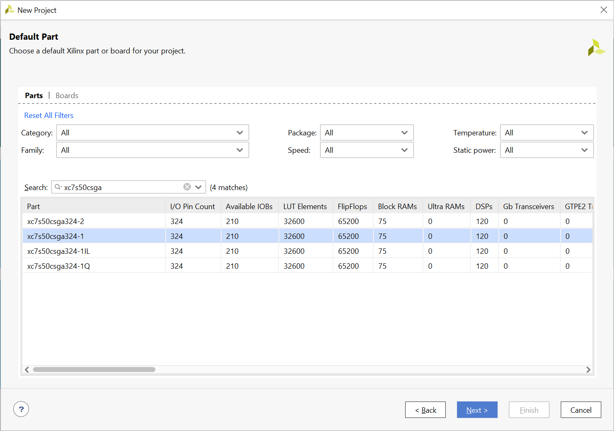
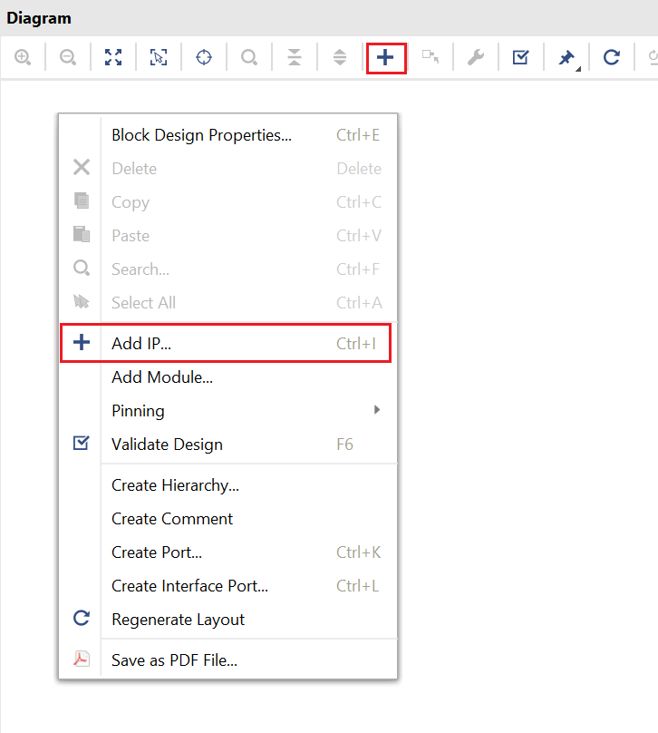
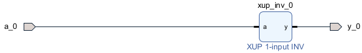
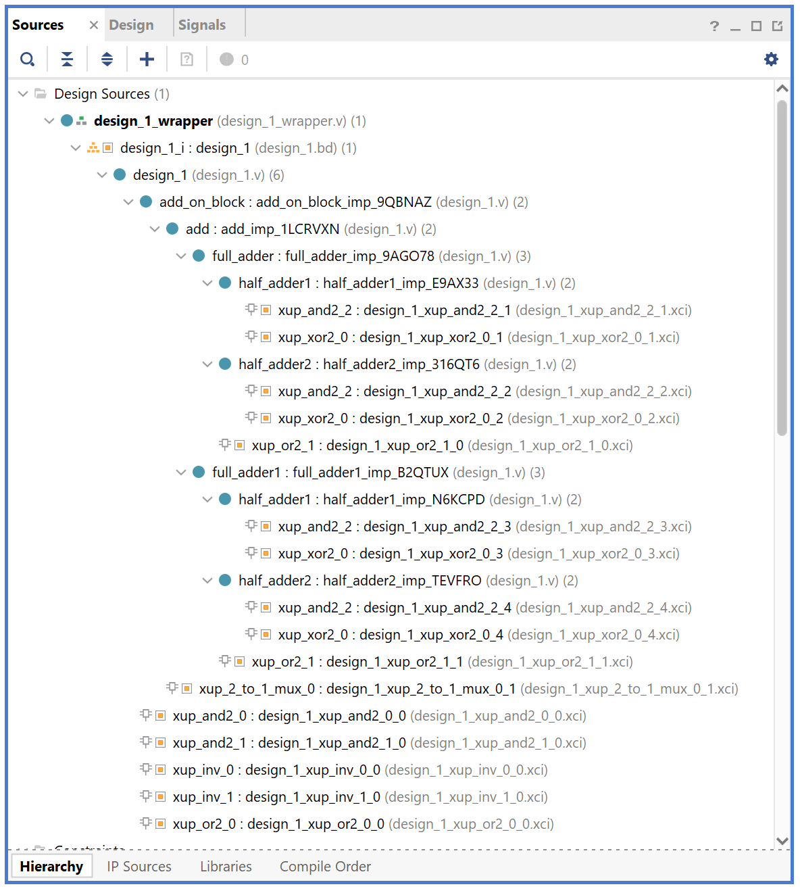
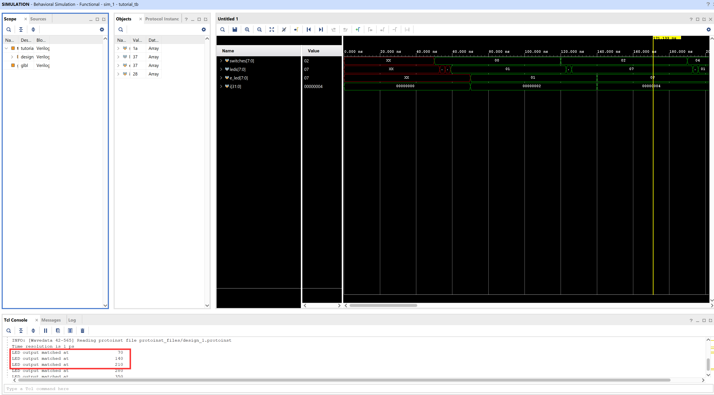
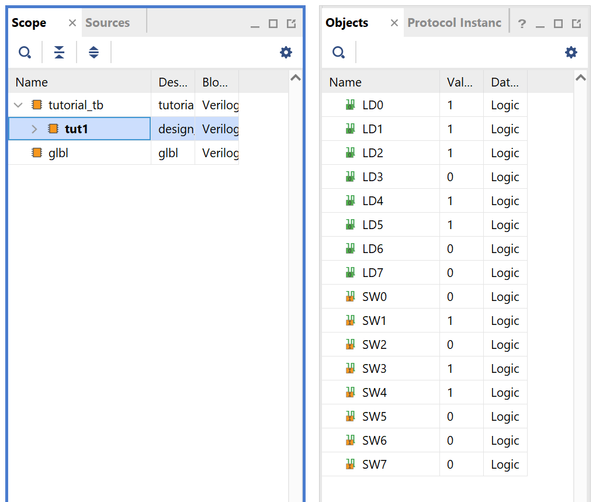
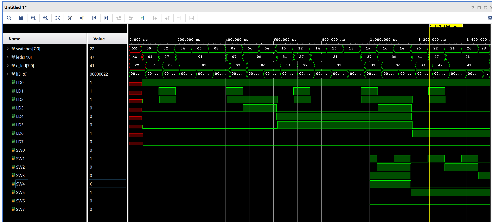

# Vivado Tutorial Using IP Integrator

## Introduction

This tutorial guides you through the design flow using Xilinx Vivado software to create a simple digital circuit using Vivado IP Integrator (IPI). A typical design flow consists of creating a Vivado project, optionally setting a user-defined IP library settings, creating a block design using various IP, creating a HDL wrapper, creating and/or adding user constraint file(s), optionally running behavioral simulation, synthesizing the design, implementing the design, generating the bitstream, and finally verifying the functionality in the hardware by downloading the generated bitstream file.  You will go through the typical design flow targeting the Sprtan-50T based Boolean Board and Zynq-7020 based PYNQ-Z2

## Objectives

After completing this tutorial, you will be able to:

- Create a Vivado project targeting a specific FPGA device located on the Boolean or PYNQ-Z2 board

-  Use the provided partially completed Xilinx Design Constraint (XDC) file to constrain some of the pin locations

-  Add additional constraints using the Tcl scripting feature of Vivado

- Simulate the design using the XSim simulator

- Synthesize and implement the design 

- Generate the bitstream

- Configure the FPGA using the generated bitstream and verify the functionality

## Procedure 

This tutorial is broken into steps that consist of general overview statements providing information on the detailed instructions that follow. Follow these detailed instructions to progress through the tutorial.

Design Description

The design consists of some inputs directly connected to the corresponding output LEDs. Other inputs are logically operated on before the results are output on the remaining LEDs as shown in **Figure 1**. 


<center>Figure 1. Completed Design</center>

## General Flow for this tutorial

- Create a Vivado project and set IP library setting

- Create a block design

- Create a HDL wrapper and add the provided constraint file

- Simulate the design using XSim simulator

- Synthesize the design

- Implement the design

- Perform the timing simulation

- Verify the functionality in hardware using the target board

###  In the instructions for the labs

The absolute path for the source code should only contain ascii characters. Deep path should also be avoided since the maximum supporting length of path for Windows is 260 characters.

For more information, you can refer [this](https://www.xilinx.com/support/documentation/sw_manuals/xilinx2020_2/ug973-vivado-release-notes-install-license.pdf)

**{SOURCES}** refers to *\\Vivado_tutorial_Using_IP_Integrator\\source\\Vivado_tutorial_Using_IP_Integrator*. You can download the source files for the labs from the cloned sources directory

**{LABS}** refers to *C:\digital_design_tutorial\\*. It assumes that you will create the mentioned directory structure to carry out the labs of this workshop

## Step 1 Create a Vivado Project using IDE

### Create a Vivado Project

Launch Vivado and create a project targeting the *Boolean* and using the Verilog HDL. Use the provided Verilog source files and *tutorial_boolean.xdc*  filefrom the {SOURCES} directory.

1. Open Vivado by selecting **Start > Xilinx Design Tools > Vivado 2021.2**

2. Click **Create New Project** to start the wizard. You will see *Create A New Vivado Project* dialog box. Click **Next**.

3. Click the Browse button of the *Project location* field of the **New Project** form, browse to **{LABS}**, and click **Select**.

4. Enter **tutorial** in the *Project name* field.  Make sure that the *Create Project Subdirectory* box is checked.  Click **Next**.


<center>Figure 2. Project Name and Location entry</center>


5. Select **RTL Project** option in the *Project Type* form and click **Next**.

6. Select **Verilog** as the *Target language* and *Simulator language* in the *Add Sources* form.

7. Click **Next**.

8. Click **Next** to get to the *Add Constraints*  form.

9. Select constraints file entries, if displayed, and use ‘X’ button on the right to remove it.

   This Xilinx Design Constraints file assigns the physical IO locations on FPGA to the switches and LEDs located on the board.  This information can be obtained either through a board’s schematic or board’s user guide. We will add the file later.

10. In the *Default Part* form, using the **Parts** option and various drop-down fields of the **Filter section**, Select the **XC7Z020clg400-1**(for PYNQ-Z2) or **xc7s50csga324-1** (for Boolean).

    



<center>Figure 3. Part selection for Boolean </center>


<center>Figure 4. Part selection for PYNQ-Z2 </center>

11. Click **Finish** to create the Vivado project. 

    Use the Windows Explorer and look at the **{LABS}** directory. You will find that file structure as shown below

    ```
    //File structure of created vivado project
    
    vivado_tutorial
    │  vivado_tutorial.xpr
    │
    ├─vivado_tutorial.cache
    │  └─wt
    │          project.wpc
    │
    ├─vivado_tutorial.hw
    │      vivado_tutorial.lpr
    │
    ├─vivado_tutorial.ip_user_files
    └─vivado_tutorial.sim
    ```

    File with extension name `.xpr` is the *(Vivado) Project File*

### Set IP repository path to point to the provided XUP IP library

1. In the *Flow Navigator* window, click on **Settings** under the Project Manager group.


2. In the *Project Settings* window, click on the **IP > Repository**

   

   <center>Figure 6. Project Settings Panel</center>

3. Click on the   button, browse to **{SOURCES}** and select **XUP_LIB** directory, and click **Refresh All > OK**.

   The directory will be scanned and the available IP entries will be displayed.


<center>Figure 7. Adding IP Repositories</center>

## Step 2 Create a Block Design

### Create a block design

1. In the *Flow Navigator* window, click on **Create Block Design** under the IP Integrator block

   

   Figure 8. Invoking IP Integrator to create a block diagram

2. Click **OK** to create a block design named *design_1*

3. IP from the catalog can be added in different ways. Click on *Add IP* in the message at the top of the *Diagram* panel, or press Ctrl + I, or right-click anywhere in the Diagram workspace and select Add IP



Figure 9. Add IP to Block Diagram

4. Once the IP Catalog is open, type “inv” into the Search bar, find and double click on **XUP 1-input INV** entry, or click on the entry and hit the Enter key to add it to the design.


Figure 10. Add an inverter to the design

5. Similarly, another instance of an inverter.

6. Add two instances of 2-input AND gate and an instance of 2-input OR gate.

   You can create an instance of already present IP, by clicking on it, pressing Ctrl key, and dragging the instance with the left mouse button.


Figure 11. Added necessary instances

### Complete the Design

1. Right-click on the **xup_inv_0** instance’s input port and select **Make External**. Similarly, make the output port of the same instance and make it external.



Figure 12. Making Ports External

2. Click on the *a* port, and change the name to **SW0** in its properties form.

   

3. Similarly, change the output port *y* to **LD0** (as per the diagram in Figure 1)

4. Arrange OR2 instance such that it is close to the two instances of the AND2. 

5. Arrange the second instance of the inverter on the left of one of the AND2 gate

6. Using the left-button of the mouse, draw a connection between the outputs of the AND2 instances and the two input of the OR2.

   When you move the mouse closer to a port, the cursor becomes drawing pencil icon. Click the left-button of the mouse and keeping the button pressed draw it towards the destination port. You make a connection this way. 

7. Similarly, connect the output of the inverter to one input of one of the AND2 instances.

   

Figure 14. Connecting Instances

  This diagram is similar to the logic connected between SW1, SW2, SW3, and LD2.

8. Make input ports of the **xup_inv_1**, *a* port of the **xup_and2_0**, and *b* port of the **xup_and2_1** instances external.
9. Similarly, make the output port of the **xup_or2_0** instance external.


Figure 15. Making ports external

10. Change the name of *a* to **SW1**, *a_1* to **SW2**, *b* to **SW3**, and *y* to **LD2**.

11. Right-click somewhere on the canvas and select Create Port.

    A Create Port form will appear.

12. Enter **LD1** as the port name, using the drop-down button select the type as *output*, and click **OK**

    

Figure 16. Creating an output port

13. Similarly, create the output port naming it as **LD3**

14. Connect the input port *a* of the **xup_and2_1** instance to output port of the instance **xup_inv_1**.

15. Connect the output port of the **xup_and2_0** to **LD1** and **xup_and2_1** to **LD3**. Click on the re-draw button.

    The diagram will look similar to shown below.

    

Figure 17. Partially completed design

### Complete the design including rest of the switches and LDs

1. Right-click on the canvas and create an input port *SW4*.

2. Similarly, create *SW5*, *SW6*, and *SW7* as input ports, and *LD4*, *LD5*, *LD6*, and *LD7* as output ports.

3. Using wiring tool, connect *SW4* to *LD4*, *SW5* to *LD5*, *SW6* to *LD6*, and *SW7* to *LD7*.

4. Click the re-draw button.

   The design should look like as shown below.

   

   Figure 18. The completed design

5. Select **File > Save Block Design.**

## Step 3 Create HDL Wrapper and Add a Constraint File

### Create a HDL wrapper and analyze the hierarchy

1. In the *sources* view, Right Click on the block diagram file, **design_1.bd**, and select **Create HDL Wrapper** to create the HDL wrapper file. When prompted, select **Let Vivado manage wrapper and auto-update**, click **OK.**

2. In the *Sources* pane, expand the hierarchy. 

   Notice the design_1_wrapper file instantiates design_1 which in turn instantiates the inverter twice, and2 twice, and or2 once.



Figure 19. Hierarchical design

3. Double-click the **design_1_wrapper.v** entry to open the file in text mode and observe the instantiation of the *design_1* module.
4. Double-click the **design_1.v** entry to open the file in text mode and observe the instantiation of the lower-level modules.

### Add tutorial_boolean.xdc (for Boolean Board) constraints source and analyze the content.

1. Click on the **Add Sources** under the *Project Manager* group in the *Flow Navigator* window.

2. Select the **Add or Create Constraints** option and click **Next**.

3. Click **Add Files…** and browse to **{SOURCES}\tutorial**

4. Select **tutorial_boolean.xdc** (for Boolean Board) and click **OK**.

5. Click **Finish** to close the window and add the constraints file in the project under the Constraints group.

   

Figure 20. Constraints file added for Boolean Board

6. In the *Sources* pane, expand the *Constraints* folder and double-click the **tutorial_boolean.xdc** entry to open the file in text mode.
7. Lines 10-17 define the pin locations of the input SW0~6 and lines 21-30 define the pin locations of the output LD0~6. The SW7 and LD7 are deliberately not defined so you can learn how to enter them using other methods.

### Perform RTL analysis on the source file.

1. Expand the *Open Elaborated Design* entry under the *RTL Analysis* tasks of the *Flow Navigator* pane and click on **Schematic**.

2. Click **Save** if asked.

   The model (design) will be elaborated and a logic view of the design is displayed.

3. Click on the **+** sign inside the block to see its content. Use the *Zoom Full()* button.


Figure 21. A logic View of the design

  Notice that some of the switch inputs go through gates before being output to LEDs and the rest go straight through to LEDs as modeled in the file.

### Add I/O constraints for the missing LED and switch pins

1. Once RTL analysis is performed, another standard layout called the *I/O Planning* is available. Click on the drop-down button and select the *I/O Planning* layout.

   

   Figure 22. I/O Planning layout selection

   Notice that the Package view is displayed in the Auxiliary View area, Device Constraints tab is selected, and I/O ports tab is displayed in the Console View area. Also notice that design ports (LD* and SW*) are listed in the I/O Ports tab with both having multiple I/O standards.

   Move the mouse cursor over the Package view, highlighting different pins. Notice the pin site number is shown at the bottom of the Vivado GUI, along with the pin type (User IO, GND, VCCO…) and the I/O bank it belongs to.


Figure 23. I/O Planning layout view of Boolean

2. Click under the *I/O Std* column across the **LD7** row and select *LVCOMS33*. This assigns the LVCMOS33 standard to the site.

   

Figure 24. Assigning I/O standard to Boolean

3. Similarly, click under the *Site* column across LD7 row to see a drop-down box appear. Type **E** (for Boolean)  in the field to jump to Exx  pins, scroll-down until you see E5 (Boolean), select E5 (Boolean) and hit the *Enter* key to assign the pin.

4. You can also assign the pin constraints using tcl commands. Type in the following two commands in the Tcl Console tab to assign the *P2* (Boolean) pin location and the *LVCSMOS33* I/O standard to **SW7** hitting the Enter key after each command. 

   **Boolean:**

   ```tcl
   set_property -dict {PACKAGE_PIN P2 IOSTANDARD LVCMOS33} [get_ports {SW7}]
   ```

   Observe the pin and I/O standard assignments in the I/O Ports tab.You can also assign the pin by selecting its entry (SW7) in the I/O ports tab, and dragging it to the Package view, and placing it at the P2 (Boolean) location. You can assign the LVCMOS33 standard by selecting its entry (SW7), selecting Configure tab of the I/O Port Properties window, followed by clicking the drop-down button of the I/O standard field, and selecting LVCMOS33.

   

   Figure 25. Assigning I/O standard through the I/O Port Properties form

5. Select **File > Constraints > Save ** and click **OK** to save the constraints in the **tutorial_boolean.xdc** file.

   ## Step 4 Simulate the Design using the XSim Simulator

   ### Add the tutorial_tb.v testbench file

1. Click **Add Sources** under the *Project Manager* tasks of the *Flow Navigator* pane.

2. Select the *Add or Create Simulation Sources* option and click **Next**.

3. In the *Add Sources Files* form, click the **Add Files…** button.

4. Browse to the **{SOURCES}\tutorial** folder and select *tutorial_tb.v* and click **OK**.

5. Click **Finish**.

6. Select the *Sources* tab and expand the *Simulation Sources* group.

   The tutorial_tb.v file is added under the *Simulation Sources* group, and **system_wrapper_1.v** is automatically placed in its hierarchy as a tut1 instance.


Figure 26. Simulation Sources hierarchy

7. Using the Windows Explorer, verify that the **sim_1** directory is created at the same level as constrs_1 and sources_1 directories under the tutorial.srcs directory, and that a copy of tutorial_tb.v is placed under **vivao_tutorial.srcs > sim_1 > imports > tutorial**.
8. Double-click on the **tutorial_tb** in the *Sources* pane to view its contents.

```verilog
// The self-checking testbench

`timescale 1ns / 1ps
/////////////////////////////////////////////////////////////////
// Module Name: tutorial_tb
/////////////////////////////////////////////////////////////////
module tutorial_tb(
    ); 
    reg [7:0] switches;
    wire [7:0] leds;
    reg [7:0] e_led;    
    integer i;    
    design_1_wrapper tut1(
            .LD0(leds[0]),
            .LD1(leds[1]),
            .LD2(leds[2]),
            .LD3(leds[3]),
            .LD4(leds[4]),
            .LD5(leds[5]),
            .LD6(leds[6]),
            .LD7(leds[7]),
            .SW0(switches[0]),
            .SW1(switches[1]),
            .SW2(switches[2]),
            .SW3(switches[3]),
            .SW4(switches[4]),
            .SW5(switches[5]),
            .SW6(switches[6]),
            .SW7(switches[7]));
 
    function [7:0] expected_led;
       input [7:0] swt;
    begin      
       expected_led[0] = ~swt[0];
       expected_led[1] = swt[1] & ~swt[2];
        expected_led[3] = ~swt[2] & swt[3];
       expected_led[2] = expected_led[1] | expected_led[3];
       expected_led[7:4] = swt[7:4];
    end   
    endfunction   
    
    initial
    begin
        for (i=0; i < 255; i=i+2)
        begin
            #50 switches=i;
            #10 e_led = expected_led(switches);
            if(leds == e_led)
                $display("LED output matched at", $time);
            else
                $display("LED output mis-matched at ",$time,": expected: %b, actual: %b", e_led, leds);
        end
    end
      
endmodule
```

The testbench defines the simulation step size and the resolution in line 1. The testbench module definition begins on line 5. Line 11 instantiates the DUT (device/module under test). Lines 29 through 38 define the same module functionality for the expected value computation. Lines 40 through 51 define the stimuli generation and compares the expected output with what the DUT provides. Line 53 ends the testbench. The $display task will print the message in the simulator console window when the simulation is run.

### Simulate the design for 1000 ns using the XSim Simulator

1. Select **Simulation Settings** under the *Project Manager* tasks of the *Flow Navigator* pane.

   A **Project Settings** form will appear showing the **Simulation** properties form.

2. Select the **Simulation** tab, and set the **Simulation Run Time** value to 200 ns and click **OK**.

3. Click on **Run Simulation > Run Behavioral Simulation** under the *Project Manager* tasks of the *Flow Navigator* pane.

   The testbench and source files will be compiled and the XSim simulator will be run (assuming no errors). You will see a simulator output similar to the one shown below.



Figure 27. Simulator output

   You will see four main views:

(i) *Scopes,* where the testbench hierarchy as well as glbl instances are displayed, 

(ii) *Objects,* where top-level signals are displayed,

(iii) the waveform window, and

(iv) *Tcl Console* where the simulation activities are displayed. Notice that since the testbench used is self-checking, the results are displayed as the simulation is run.

Notice that the **tutorial.sim** directory is created under the **tutorial** directory, along with several lower-level directories. 

```
// Dictionary structure after running behavioral simulation
vivado_tutorial.sim
└─sim_1
    └─behav
        └─xsim
            │  compile.bat
            │  compile.log
            │  elaborate.bat
            │  elaborate.log
            │  glbl.v
            │  simulate.bat
            │  simulate.log
            │  tutorial_tb.tcl
            │  tutorial_tb_behav.wdb
            │  tutorial_tb_vlog.prj
            │  xelab.pb
            │  xsim.ini
            │  xsim.ini.bak
            │  xvlog.log
            │  xvlog.pb
            │
            ├─protoinst_files
            │      design_1.protoinst
            │
            └─xsim.dir
                ├─tutorial_tb_behav
                │  │  Compile_Options.txt
                │  │  TempBreakPointFile.txt
                │  │  xsim.dbg
                │  │  xsim.mem
                │  │  xsim.reloc
                │  │  xsim.rlx
                │  │  xsim.rtti
                │  │  xsim.svtype
                │  │  xsim.type
                │  │  xsim.xdbg
                │  │  xsimcrash.log
                │  │  xsimk.exe
                │  │  xsimkernel.log
                │  │  xsimSettings.ini
                │  │
                │  └─obj
                │          xsim_0.win64.obj
                │          xsim_1.c
                │          xsim_1.win64.obj
                │
                └─xil_defaultlib
                        design_1.sdb
                        design_1_wrapper.sdb
                        design_1_xup_and2_0_0.sdb
                        design_1_xup_and2_0_1.sdb
                        design_1_xup_inv_0_0.sdb
                        design_1_xup_inv_0_1.sdb
                        design_1_xup_or2_0_1.sdb
                        glbl.sdb
                        tutorial_tb.sdb
                        xil_defaultlib.rlx
                        xup_and2.sdb
                        xup_inv.sdb
                        xup_or2.sdb
```

4. Click on the *Zoom Fit* button () located left of the waveform window to see the entire waveform.

   Notice that the output changes when the input changes.

   You can also float the simulation waveform window by clicking on the Float button on the upper right hand side of the view. This will allow you to have a wider window to view the simulation waveforms. To reintegrate the floating window back into the GUI, simply click on the Dock Window button.


Figure 28. Float Button


Figure 29. Dock Window Button

### Change display format if desired

1. Select **i[31:0]** in the waveform window, right-click, select *Radix*, and then select *Unsigned Decimal* to view the for-loop index in *integer* form. Similarly, change the radix of **switches[7:0]** to *Hexadecimal*. Leave the **leds[7:0]** and **e_led[7:0]** radix to *binary* as we want to see each output bit.

### Add more signals to monitor lower-level signals and continue to run the simulation for 500 ns.

1. Expand the **tutorial_tb** instance, if necessary, in the *Scopes* window and select the **tut1** instance.

   The SW* (7 to 0)] and LD* (7 to 0) signals will be displayed in the *Objects* window.

   

Figure 30. Selecting lower-level signals

2. Select **SW\*** and **LD\*** and drag them into the waveform window to monitor those lower-level signals.

3. On the simulator tool buttons ribbon bar, type 500 in the time window,  click on the drop-down button of the units field and select ns, and click on the () button.

   The simulation will run for an additional 500 ns. 

4. Click on the *Zoom Fit* button and observe the output.



Figure 31. Running simulation for additional 500 ns

5. Close the simulator by closing the *SIMULATION* window

## Step 5 Synthesize the Design

### Synthesize the design with the Vivado synthesis tool and analyze the Project Summary output.  

1. Click on **Run Synthesis** under the *Synthesis* tasks of the *Flow Navigator* pane.

   The synthesis process will be run on the tutorial.v file (and all its hierarchical files if they exist). When the process is completed a *Synthesis Completed* dialog box with three options will be displayed.

2. Select the *Open Synthesized Design* option and click **OK** as we want to look at the synthesis output before progressing to the implementation stage.

   Click **Yes** to close the elaborated design if the dialog box is displayed.

3. Select the **Project Summary** tab (Select default layout if the tab is not visible) and understand the various windows.

​                                Figure 33. Project Summary view

Click on the various links to see what information they provide and which allows you to change the synthesis settings.
